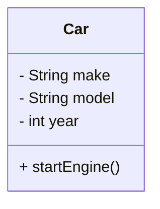
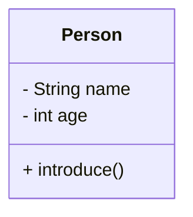
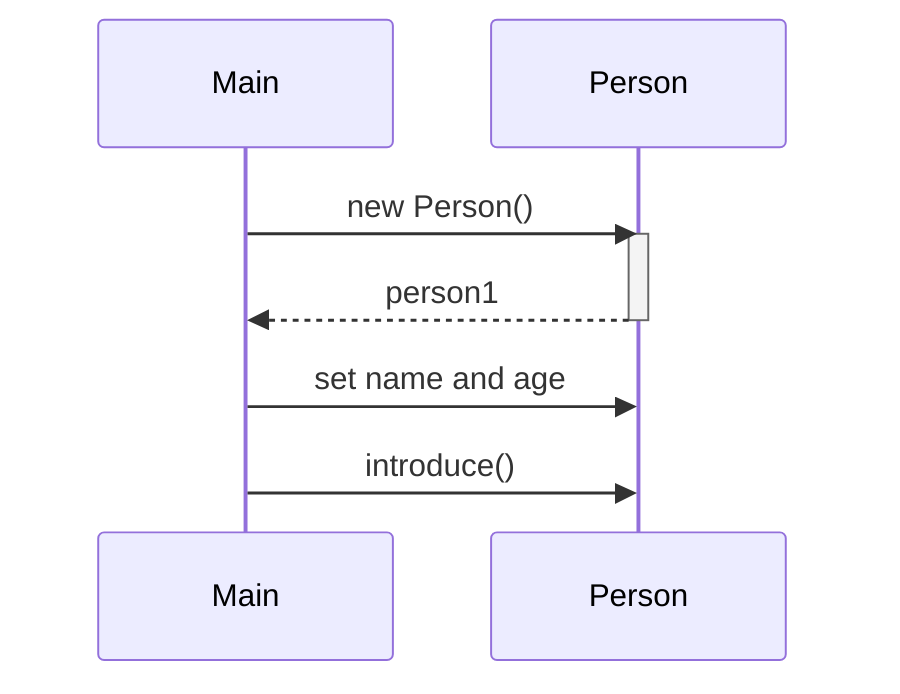
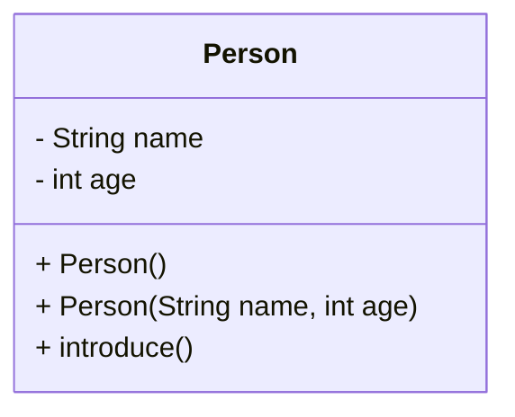
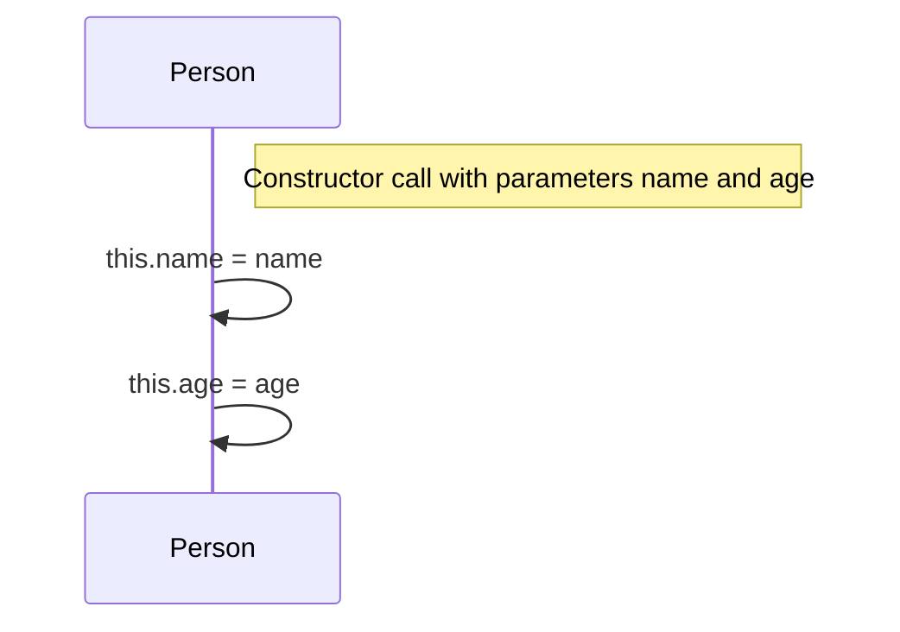
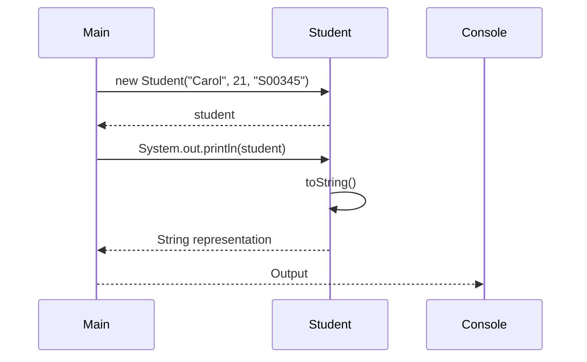

# Java Classes and Objects Lab

## Agenda

1. [Introduction](#1-introduction)
2. [Defining Classes](#2-defining-classes)
3. [Creating Objects](#3-creating-objects)
4. [Constructors](#4-constructors)
5. [The `this` Keyword](#5-the-this-keyword)
6. [Overriding the `toString()` Method](#6-overriding-the-tostring-method)
7. [Summary and Further Reading](#7-summary-and-further-reading)

---

## 1. Introduction

### Explanation

Object-Oriented Programming (OOP) is a programming paradigm centered around the concept of "objects" that contain data and methods. In Java, OOP allows developers to create modular, reusable code by defining classes and creating objects from those classes.

**Key Concepts:**

- **Classes**: Blueprints or templates that define the structure (fields) and behavior (methods) of objects.
- **Objects**: Instances of classes that hold actual values and can perform actions defined by their class.

### Example

Consider a simple `Car` class that defines the blueprint for a car object.

```java
public class Car {
    // Fields
    String make;
    String model;
    int year;
    
    // Methods
    public void startEngine() {
        System.out.println("Engine started.");
    }
}
```

### Mermaid Diagram



### DIY Coding Task

**Objective**: Think about real-world objects and how they can be represented as classes in Java.

**Task**:

1. Choose a real-world object (e.g., `Bicycle`, `Book`, `Phone`).
2. Create a Java class for this object.
3. Define at least three fields (attributes) and one method (behavior).
4. Write code to define the class in a `.java` file.

---

## 2. Defining Classes

### Explanation

In Java, a class is defined using the `class` keyword followed by the class name and a pair of curly braces `{}`. Inside the class, you can define fields (attributes) and methods (behaviors).

**Syntax:**

```java
public class ClassName {
    // Fields (attributes)
    // Methods (behaviors)
}
```

### Example

Let's define a `Person` class with some attributes and methods.

```java
public class Person {
    // Fields
    String name;
    int age;

    // Methods
    public void introduce() {
        System.out.println("Hi, I'm " + name + " and I'm " + age + " years old.");
    }
}
```

### Mermaid Diagram



### DIY Coding Task

**Objective**: Create a `Student` class.

**Task**:

1. Define a class named `Student`.
2. Add fields: `String name`, `int age`, `String studentID`.
3. Write a method `displayInfo()` that prints the student's details.
4. Write the code in a `Student.java` file.

**Sample Output when `displayInfo()` is called**:

```
Name: Alice Smith
Age: 20
Student ID: S00123
```

---

## 3. Creating Objects

### Explanation

An object is an instance of a class. It is created using the `new` keyword followed by the class constructor.

**Syntax:**

```java
ClassName objectName = new ClassName();
```

### Example

Using the `Person` class defined earlier, let's create an object.

```java
public class Main {
    public static void main(String[] args) {
        // Creating an object of Person class
        Person person1 = new Person();
        person1.name = "John Doe";
        person1.age = 25;

        // Calling the method
        person1.introduce(); // Output: Hi, I'm John Doe and I'm 25 years old.
    }
}
```

### Mermaid Diagram



### DIY Coding Task

**Objective**: Create an object of the `Student` class you defined in the previous section.

**Task**:

1. In a `Main.java` file, write the `main` method.
2. Create an instance of `Student`:
   - Assign values to its fields (`name`, `age`, `studentID`).
3. Call the `displayInfo()` method to print the student's details.
4. Compile and run your program to ensure it works correctly.

---

## 4. Constructors

### Explanation

Constructors are special methods used to initialize objects. They have the same name as the class and no return type.

- **Default Constructor**: Provided by Java if no constructors are defined. Initializes fields to default values.
- **Parameterized Constructor**: Allows you to set initial values for fields.

**Default Constructor Example:**

```java
public class Person {
    // Fields
    String name;
    int age;

    // Default constructor
    public Person() {
        name = "Unknown";
        age = 0;
    }
}
```

**Parameterized Constructor Example:**

```java
public class Person {
    // Fields
    String name;
    int age;

    // Parameterized constructor
    public Person(String name, int age) {
        this.name = name;
        this.age = age;
    }
}
```

### Mermaid Diagram



### Example

Using the `Person` class with constructors.

```java
public class Main {
    public static void main(String[] args) {
        // Using default constructor
        Person person1 = new Person();
        person1.introduce(); // Output: Hi, I'm Unknown and I'm 0 years old.

        // Using parameterized constructor
        Person person2 = new Person("Alice", 30);
        person2.introduce(); // Output: Hi, I'm Alice and I'm 30 years old.
    }
}
```

### DIY Coding Task

**Objective**: Add constructors to your `Student` class.

**Task**:

1. In your `Student` class, add:
   - A default constructor that sets default values for the fields (`name`, `age`, `studentID`).
   - A parameterized constructor that accepts `name`, `age`, and `studentID` as parameters.
2. Modify your `Main` class to:
   - Create a `Student` object using the default constructor and call `displayInfo()`.
   - Create another `Student` object using the parameterized constructor and call `displayInfo()`.
3. Compile and run your program to see both outputs.

**Sample Output**:

```
Name: Unknown
Age: 0
Student ID: N/A

Name: Bob Johnson
Age: 22
Student ID: S00234
```

---

## 5. The `this` Keyword

### Explanation

The `this` keyword refers to the current object instance. It's commonly used to:

- Differentiate between class fields and parameters when they have the same name.
- Call other constructors in the same class.

**Example Usage:**

```java
public class Person {
    String name;
    int age;

    public Person(String name, int age) {
        this.name = name; // 'this.name' refers to the class field
        this.age = age;
    }
}
```

### Mermaid Diagram



### Example

Implementing the `this` keyword in the `Student` class.

```java
public class Student {
    String name;
    int age;
    String studentID;

    // Default constructor
    public Student() {
        this("Unknown", 0, "N/A");
    }

    // Parameterized constructor using 'this'
    public Student(String name, int age, String studentID) {
        this.name = name;
        this.age = age;
        this.studentID = studentID;
    }

    public void displayInfo() {
        System.out.println("Name: " + this.name);
        System.out.println("Age: " + this.age);
        System.out.println("Student ID: " + this.studentID);
    }
}
```

### DIY Coding Task

**Objective**: Practice using the `this` keyword.

**Task**:

1. Update your `Student` class:
   - Ensure that both constructors use the `this` keyword to refer to class fields.
   - In the default constructor, call the parameterized constructor using `this(...)`.
2. Use `this` in the `displayInfo()` method as shown.
3. Verify that your program still works as expected by compiling and running it.

---

## 6. Overriding the `toString()` Method

### Explanation

Every class in Java inherits from the `Object` class, which provides a `toString()` method that returns a string representation of the object. By default, it returns a string like `ClassName@hashcode`, which isn't very informative.

By overriding the `toString()` method, you can provide a meaningful string representation of your object.

**Default `toString()` Output:**

```java
public class Main {
    public static void main(String[] args) {
        Student student = new Student();
        System.out.println(student);
        // Output: Student@15db9742
    }
}
```

### Example

Overriding `toString()` in the `Student` class.

```java
public class Student {
    // Fields and constructors as before

    @Override
    public String toString() {
        return "Student{name='" + name + "', age=" + age + ", studentID='" + studentID + "'}";
    }
}

// In Main.java
public class Main {
    public static void main(String[] args) {
        Student student = new Student("Carol", 21, "S00345");
        System.out.println(student);
        // Output: Student{name='Carol', age=21, studentID='S00345'}
    }
}
```

### Mermaid Diagram



### DIY Coding Task

**Objective**: Override the `toString()` method in another class.

**Task**:

1. Create a new class called `Book` with fields `title`, `author`, and `price`.
2. Add a parameterized constructor that initializes these fields.
3. Override the `toString()` method to return a string representation of the `Book`.
4. In your `Main` class, create a `Book` object and print it using `System.out.println(book);`.
5. Compile and run your program to see the output.

**Sample Output**:

```
Book{title='Effective Java', author='Joshua Bloch', price=45.99}
```

---

## 7. Summary and Further Reading

In this lab, we've covered:

- Defining classes and their importance in Java OOP.
- Creating objects from classes.
- Using constructors to initialize objects.
- Understanding and using the `this` keyword.
- Overriding the `toString()` method to provide meaningful object representations.

### Further Reading

- **Official Documentation**:
  - [Java Tutorials - Classes and Objects](https://docs.oracle.com/javase/tutorial/java/javaOO/classes.html)
  - [Using the `this` Keyword](https://docs.oracle.com/javase/tutorial/java/javaOO/thiskey.html)
  - [Overriding Methods](https://docs.oracle.com/javase/tutorial/java/IandI/override.html)
- **Books**:
  - *Head First Java* by Kathy Sierra & Bert Bates
- **Online Resources**:
  - [W3Schools Java Constructors](https://www.w3schools.com/java/java_constructors.asp)
  - [GeeksforGeeks - `this` Keyword in Java](https://www.geeksforgeeks.org/this-reference-in-java/)
  - [Overriding `toString()` Method](https://www.geeksforgeeks.org/overriding-tostring-method-in-java/)

---

**Congratulations!** You've now practiced creating and using classes, constructors, the `this` keyword, and overriding the `toString()` method in Java. Keep experimenting with new classes and explore inheritance, polymorphism, and other OOP concepts to deepen your understanding.

---
