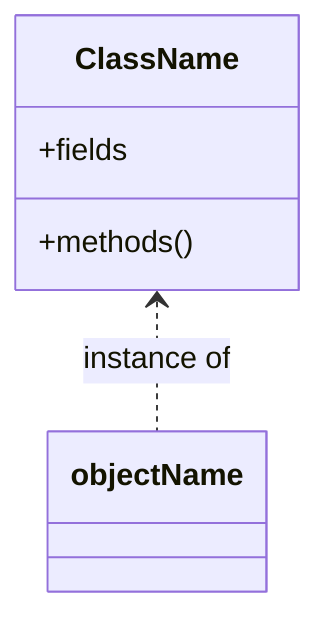
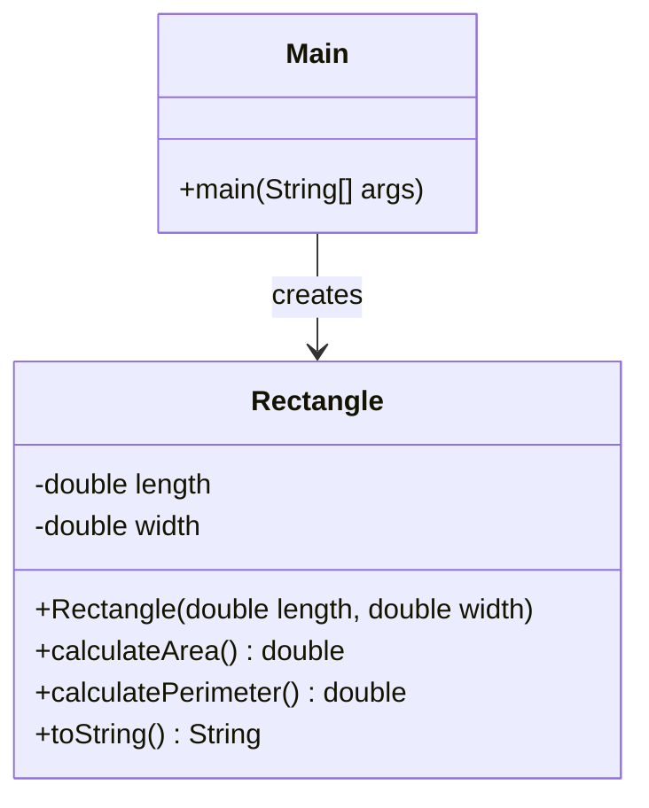
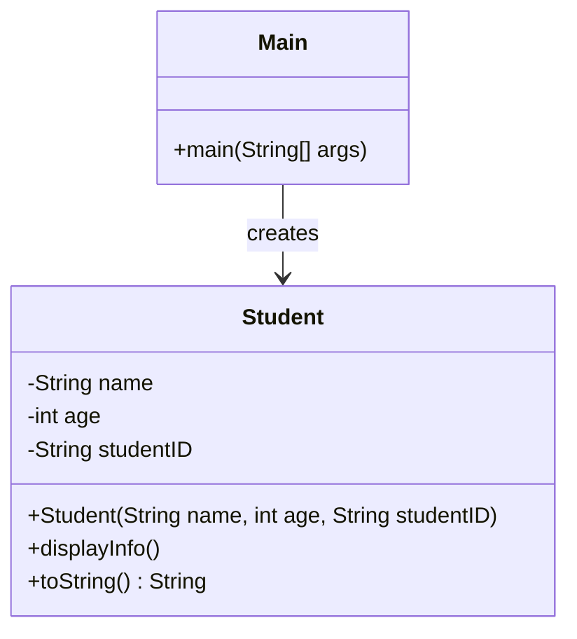
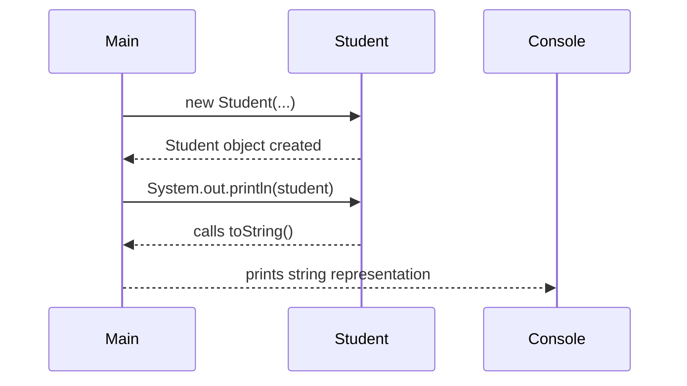

# Java Classes and Objects Lab

## Introduction

Object-Oriented Programming (OOP) is a programming paradigm centered around the concept of "objects" that contain data and methods. In Java, OOP allows developers to create modular, reusable code by defining classes and creating objects from those classes.

### What is Java OOP?

- **Classes**: Blueprints or templates that define the structure (fields) and behavior (methods) of objects.
- **Objects**: Instances of classes that hold actual values and can perform actions defined by their class.

### Uses and Benefits of Java OOP

- **Modularity**: Breaks down complex problems into smaller, manageable pieces.
- **Reusability**: Encourages code reuse through inheritance and composition.
- **Maintainability**: Simplifies code updates and debugging.
- **Scalability**: Facilitates the addition of new features with minimal code changes.
- **Abstraction**: Hides complex implementation details from the user.

## How to Create Classes and Objects

### Defining a Class

In Java, a class is defined using the `class` keyword followed by the class name and a pair of curly braces `{}`.

```java
public class ClassName {
    // Fields (attributes)
    // Methods (behaviors)
}
```

### Creating an Object

An object is created using the `new` keyword followed by the class constructor.

```java
ClassName objectName = new ClassName();
```

### Linking Classes and Objects

- **Class**: Serves as a blueprint for objects.
- **Object**: A specific instance of a class with assigned values.

**Example Relationship**:



### Constructors in Java

Constructors are special methods used to initialize objects. They have the same name as the class and no return type.

#### Default Constructor

- If you do not provide any constructor, Java provides a default constructor with no parameters.
- Initializes object with default values (e.g., `0` for numbers, `null` for objects).

```java
public class Example {
    // Fields
    int number;
    String text;
    
    // Default constructor (provided by Java)
    public Example() {
        // Initializes fields to default values
    }
}
```

#### Parameterized Constructor

- Allows you to provide initial values for object attributes.
- Accepts parameters to set initial values.

```java
public class Example {
    // Fields
    int number;
    String text;
    
    // Parameterized constructor
    public Example(int num, String txt) {
        number = num;
        text = txt;
    }
}
```

### The `this` Keyword in Java

- Refers to the current object instance.
- Used to differentiate between class fields and parameters when they have the same name.
- Can be used to call other constructors from a constructor.

**Example Usage**:

```java
public class Example {
    int number;

    public Example(int number) {
        this.number = number; // 'this.number' refers to the class field
    }
}
```

## Overriding the `toString()` Method

### What is the `toString()` Method?

- Every class in Java inherits from the `Object` class.
- The `Object` class provides a `toString()` method that returns a string representation of the object.
- By default, `toString()` returns a string that includes the class name and hash code, which is often not meaningful.
- Overriding `toString()` allows you to provide a custom string representation of your object.

**Default `toString()` Example**:

```java
public class Example {
    int number;
    String text;
}

public class Main {
    public static void main(String[] args) {
        Example ex = new Example();
        System.out.println(ex.toString());
        // Output: Example@15db9742
    }
}
```

### Overriding `toString()`

- You can override the `toString()` method in your class to return a more informative string.

**Example Override**:

```java
public class Example {
    int number;
    String text;

    @Override
    public String toString() {
        return "Example{number=" + number + ", text='" + text + "'}";
    }
}
```

**Usage**:

```java
public class Main {
    public static void main(String[] args) {
        Example ex = new Example();
        ex.number = 10;
        ex.text = "Hello";
        System.out.println(ex.toString());
        // Output: Example{number=10, text='Hello'}
    }
}
```

### Benefits of Overriding `toString()`

- **Debugging**: Easier to print object states during debugging.
- **Logging**: More informative logs when objects are printed.
- **User Interface**: Display objects meaningfully in UI components.

## Examples

### Example 1: Overriding `toString()` in `Person` Class

#### Person.java

```java
public class Person {
    // Fields
    String name;
    int age;

    // Constructor
    public Person(String name, int age) {
        this.name = name;
        this.age = age;
    }
    
    // Overriding toString()
    @Override
    public String toString() {
        return "Person{name='" + name + "', age=" + age + "}";
    }

    // Method
    public void introduce() {
        System.out.println("Hi, I'm " + name + " and I'm " + age + " years old.");
    }
}
```

#### Main.java

```java
public class Main {
    public static void main(String[] args) {
        Person person = new Person("Alice", 28);
        System.out.println(person);
        // Output: Person{name='Alice', age=28}
    }
}
```

### Example 2: Overriding `toString()` in `Rectangle` Class

#### Rectangle.java

```java
public class Rectangle {
    // Fields
    double length;
    double width;

    // Constructor
    public Rectangle(double length, double width) {
        this.length = length;
        this.width = width;
    }

    // Methods
    public double calculateArea() {
        return length * width;
    }

    public double calculatePerimeter() {
        return 2 * (length + width);
    }

    // Overriding toString()
    @Override
    public String toString() {
        return "Rectangle{length=" + length + ", width=" + width + "}";
    }
}
```

#### Main.java

```java
public class Main {
    public static void main(String[] args) {
        Rectangle rect = new Rectangle(10.0, 5.0);
        System.out.println(rect);
        // Output: Rectangle{length=10.0, width=5.0}
    }
}
```

### Diagram



## Exercises

### Exercise 1: Override `toString()` in `Student` Class

**Objective**: Practice overriding the `toString()` method to print out the state of an object.

#### Specifications

- **Fields**:
  - `String name`
  - `int age`
  - `String studentID`
- **Constructors**:
  - **Parameterized Constructor**: Initializes all fields.
- **Methods**:
  - `void displayInfo()`: Prints the student's details.
  - **Override `toString()`**: Returns a string representation of the object.

#### Instructions

1. Create the `Student.java` file and define the `Student` class.
2. Implement the constructor and the `displayInfo()` method.
3. Override the `toString()` method to return a string with all the field values.
4. In `Main.java`, create an instance of `Student` and print it using `System.out.println(student);`.

#### Sample Output

```
Student{name='Alice Smith', age=20, studentID='S00123'}
```

### Exercise 2: Override `toString()` in `Book` Class

**Objective**: Implement the `toString()` method in the `Book` class to display book details.

#### Specifications

- **Fields**:
  - `String title`
  - `String author`
  - `double price`
- **Constructors**:
  - **Parameterized Constructor**: Sets values using parameters.
- **Methods**:
  - `void displayDetails()`: Prints the book's details.
  - **Override `toString()`**: Returns a string representation of the object.

#### Instructions

1. Modify the `Book.java` file to include an overridden `toString()` method.
2. In `Main.java`, create an instance of `Book` and print it using `System.out.println(book);`.

#### Sample Output

```
Book{title='Java Programming', author='Jane Doe', price=29.99}
```

### Exercise 3: Override `toString()` in a Custom Class

**Objective**: Create a `Car` class and override the `toString()` method.

#### Specifications

- **Fields**:
  - `String make`
  - `String model`
  - `int year`
- **Constructors**:
  - **Parameterized Constructor**: Initializes all fields.
- **Methods**:
  - **Override `toString()`**: Returns a string representation of the object.

#### Instructions

1. Create the `Car.java` file and define the `Car` class.
2. Implement the constructor and override the `toString()` method.
3. In `Main.java`, create an instance of `Car` and print it using `System.out.println(car);`.

#### Sample Output

```
Car{make='Toyota', model='Corolla', year=2021}
```

## Mermaid Diagrams

### Class Diagram with `toString()` Method



### Object Interaction Flow with `toString()`



## Summary and Further Reading

In this lab, we've covered:

- The fundamentals of Java classes and objects.
- How to define classes with fields, constructors, and methods.
- The use of default and parameterized constructors.
- How to use the `this` keyword in Java.
- Overriding the `toString()` method to provide custom string representations of objects.
- Creating objects and invoking methods.
- Visualizing class structures and object interactions using Mermaid diagrams.

### Further Reading

- **Official Documentation**:
  - [Java Tutorials - Classes and Objects](https://docs.oracle.com/javase/tutorial/java/javaOO/classes.html)
  - [Java Tutorials - Overriding Methods](https://docs.oracle.com/javase/tutorial/java/IandI/override.html)
  - [Java Tutorials - The `toString()` Method](https://docs.oracle.com/javase/tutorial/java/data/numberformat.html)
- **Books**:
  - *Head First Java* by Kathy Sierra & Bert Bates
- **Online Resources**:
  - [W3Schools Java `toString()`](https://www.w3schools.com/java/ref_string_tostring.asp)
  - [GeeksforGeeks - Overriding `toString()` Method](https://www.geeksforgeeks.org/overriding-tostring-method-in-java/)

---

**Congratulations!** You've now practiced creating and using classes, constructors, the `this` keyword, and overriding the `toString()` method in Java. Keep experimenting with new classes and explore inheritance, polymorphism, and other OOP concepts to deepen your understanding.
