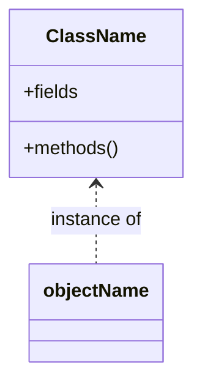
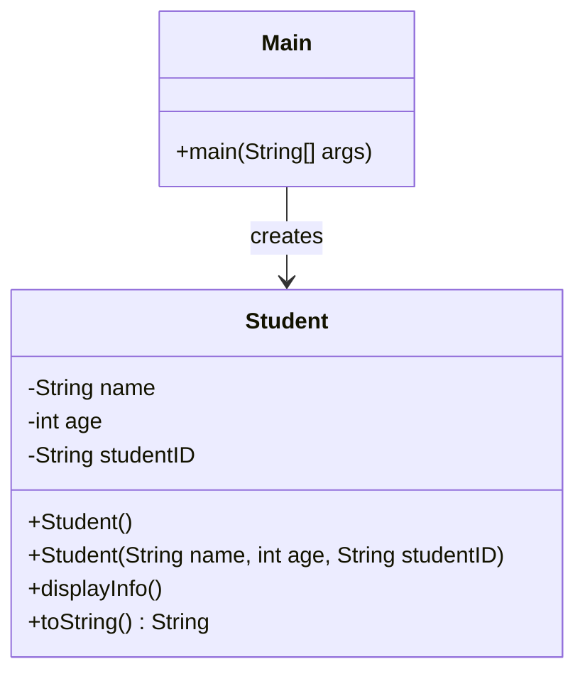
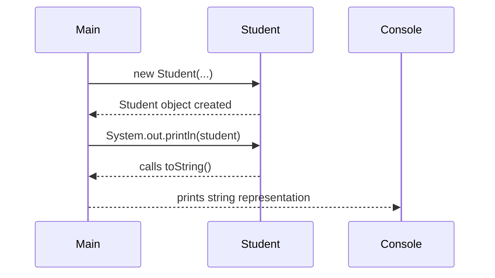

# Java Classes and Objects Lab

## Agenda

1. [Introduction](#1-introduction)
2. [How to Create Classes and Objects](#2-how-to-create-classes-and-objects)
3. [Overriding the `toString()` Method](#3-overriding-the-tostring-method)
4. [Examples](#4-examples)
5. [Exercises](#5-exercises)
6. [Mermaid Diagrams](#6-mermaid-diagrams)
7. [Summary and Further Reading](#7-summary-and-further-reading)

---

## 1. Introduction

Object-Oriented Programming (OOP) is a programming paradigm centered around the concept of "objects" that contain data and methods. In Java, OOP allows developers to create modular, reusable code by defining classes and creating objects from those classes.

### 1.1 What is Java OOP?

- **Classes**: Blueprints or templates that define the structure (fields) and behavior (methods) of objects.
- **Objects**: Instances of classes that hold actual values and can perform actions defined by their class.

### 1.2 Uses and Benefits of Java OOP

- **Modularity**: Breaks down complex problems into smaller, manageable pieces.
- **Reusability**: Encourages code reuse through inheritance and composition.
- **Maintainability**: Simplifies code updates and debugging.
- **Scalability**: Facilitates the addition of new features with minimal code changes.
- **Abstraction**: Hides complex implementation details from the user.

## 2. How to Create Classes and Objects

### 2.1 Defining a Class

In Java, a class is defined using the `class` keyword followed by the class name and a pair of curly braces `{}`.

```java
public class ClassName {
    // Fields (attributes)
    // Methods (behaviors)
}
```

### 2.2 Creating an Object

An object is created using the `new` keyword followed by the class constructor.

```java
ClassName objectName = new ClassName();
```

### 2.3 Linking Classes and Objects

- **Class**: Serves as a blueprint for objects.
- **Object**: A specific instance of a class with assigned values.

**Example Relationship**:



### 2.4 Constructors in Java

Constructors are special methods used to initialize objects. They have the same name as the class and no return type.

#### 2.4.1 Default Constructor

- If you do not provide any constructor, Java provides a default constructor with no parameters.
- Initializes object with default values (e.g., `0` for numbers, `null` for objects).

```java
public class Example {
    // Fields
    int number;
    String text;
    
    // Default constructor (provided by Java)
    public Example() {
        // Initializes fields to default values
    }
}
```

#### 2.4.2 Parameterized Constructor

- Allows you to provide initial values for object attributes.
- Accepts parameters to set initial values.

```java
public class Example {
    // Fields
    int number;
    String text;
    
    // Parameterized constructor
    public Example(int num, String txt) {
        number = num;
        text = txt;
    }
}
```

### 2.5 The `this` Keyword in Java

- Refers to the current object instance.
- Used to differentiate between class fields and parameters when they have the same name.
- Can be used to call other constructors from a constructor.

**Example Usage**:

```java
public class Example {
    int number;

    public Example(int number) {
        this.number = number; // 'this.number' refers to the class field
    }
}
```

## 3. Overriding the `toString()` Method

### 3.1 What is the `toString()` Method?

- Every class in Java inherits from the `Object` class.
- The `Object` class provides a `toString()` method that returns a string representation of the object.
- By default, `toString()` returns a string that includes the class name and hash code, which is often not meaningful.
- Overriding `toString()` allows you to provide a custom string representation of your object.

**Default `toString()` Example**:

```java
public class Example {
    int number;
    String text;
}

public class Main {
    public static void main(String[] args) {
        Example ex = new Example();
        System.out.println(ex.toString());
        // Output: Example@15db9742
    }
}
```

### 3.2 Overriding `toString()`

- You can override the `toString()` method in your class to return a more informative string.

**Example Override**:

```java
public class Example {
    int number;
    String text;

    @Override
    public String toString() {
        return "Example{number=" + number + ", text='" + text + "'}";
    }
}
```

**Usage**:

```java
public class Main {
    public static void main(String[] args) {
        Example ex = new Example();
        ex.number = 10;
        ex.text = "Hello";
        System.out.println(ex.toString());
        // Output: Example{number=10, text='Hello'}
    }
}
```

### 3.3 Benefits of Overriding `toString()`

- **Debugging**: Easier to print object states during debugging.
- **Logging**: More informative logs when objects are printed.
- **User Interface**: Display objects meaningfully in UI components.

## 4. Examples

### 4.1 Example 1: Defining and Using Constructors

#### 4.1.1 Person.java

```java
public class Person {
    // Fields
    String name;
    int age;

    // Default Constructor
    public Person() {
        name = "Unknown";
        age = 0;
    }

    // Parameterized Constructor
    public Person(String name, int age) {
        this.name = name; // Using 'this' keyword
        this.age = age;
    }
    
    // Overriding toString()
    @Override
    public String toString() {
        return "Person{name='" + name + "', age=" + age + "}";
    }

    // Method
    public void introduce() {
        System.out.println("Hi, I'm " + name + " and I'm " + age + " years old.");
    }
}
```

#### 4.1.2 Main.java

```java
public class Main {
    public static void main(String[] args) {
        // Using default constructor
        Person person1 = new Person();
        person1.introduce(); // Output: Hi, I'm Unknown and I'm 0 years old.
        System.out.println(person1);
        // Output: Person{name='Unknown', age=0}

        // Using parameterized constructor
        Person person2 = new Person("John Doe", 25);
        person2.introduce(); // Output: Hi, I'm John Doe and I'm 25 years old.
        System.out.println(person2);
        // Output: Person{name='John Doe', age=25}
    }
}
```

### 4.2 Example 2: Using `this` Keyword

#### 4.2.1 Rectangle.java

```java
public class Rectangle {
    // Fields
    double length;
    double width;

    // Parameterized Constructor
    public Rectangle(double length, double width) {
        this.length = length; // 'this.length' refers to the class field
        this.width = width;   // 'this.width' refers to the class field
    }

    // Methods
    public double calculateArea() {
        return length * width;
    }

    public double calculatePerimeter() {
        return 2 * (length + width);
    }

    // Overriding toString()
    @Override
    public String toString() {
        return "Rectangle{length=" + length + ", width=" + width + "}";
    }
}
```

#### 4.2.2 Main.java

```java
public class Main {
    public static void main(String[] args) {
        // Creating an object of Rectangle class
        Rectangle rect = new Rectangle(10.0, 5.0);

        // Using the object's methods
        double area = rect.calculateArea();            // Output: 50.0
        double perimeter = rect.calculatePerimeter();  // Output: 30.0

        System.out.println(rect);
        // Output: Rectangle{length=10.0, width=5.0}
        System.out.println("Area: " + area);
        System.out.println("Perimeter: " + perimeter);
    }
}
```

### 4.3 Diagram

```mermaid
classDiagram
    class Rectangle {
        -double length
        -double width
        +Rectangle(double length, double width)
        +calculateArea() double
        +calculatePerimeter() double
        +toString() String
    }

    class Main {
        +main(String[] args)
    }

    Main --> Rectangle : creates
```

## 5. Exercises

### 5.1 Exercise 1: Create a `Student` Class with Constructors

**Objective**: Define a `Student` class with default and parameterized constructors.

#### Specifications

- **Fields**:
  - `String name`
  - `int age`
  - `String studentID`
- **Constructors**:
  - **Default Constructor**: Initializes fields to default values.
  - **Parameterized Constructor**: Initializes fields with provided values.
- **Methods**:
  - `void displayInfo()`: Prints the student's details.
  - **Override `toString()`**: Returns a string representation of the object.

#### Instructions

1. Create the `Student.java` file and define the `Student` class.
2. Implement both constructors and the `displayInfo()` method.
3. Override the `toString()` method to include all field values.
4. In `Main.java`, create instances of `Student` using both constructors and call `displayInfo()` and `System.out.println(student);`.

#### Sample Output

```
Name: Unknown
Age: 0
Student ID: N/A
Student{name='Unknown', age=0, studentID='N/A'}

Name: Alice Smith
Age: 20
Student ID: S00123
Student{name='Alice Smith', age=20, studentID='S00123'}
```

### 5.2 Exercise 2: Practice Using the `this` Keyword

**Objective**: Modify the `Employee` class to use the `this` keyword appropriately.

#### Specifications

- **Fields**:
  - `String name`
  - `int age`
  - `String employeeID`
  - `String department`
- **Constructor**:
  - Initializes all fields using the `this` keyword.
- **Methods**:
  - `void displayEmployeeInfo()`: Prints all employee details.
  - **Override `toString()`**: Returns a string representation of the object.

#### Instructions

1. Create the `Employee.java` file and define the `Employee` class.
2. Use the `this` keyword in the constructor to distinguish between parameters and class fields.
3. Implement the `displayEmployeeInfo()` method and override `toString()`.
4. In `Main.java`, create an instance of `Employee` and display the information using both methods.

#### Sample Output

```
Name: Bob Johnson
Age: 30
Employee ID: E12345
Department: Engineering
Employee{name='Bob Johnson', age=30, employeeID='E12345', department='Engineering'}
```

### 5.3 Exercise 3: Implement a `Book` Class with Constructors

**Objective**: Design a `Book` class to practice constructors, the `this` keyword, and overriding `toString()`.

#### Specifications

- **Fields**:
  - `String title`
  - `String author`
  - `double price`
- **Constructors**:
  - **Default Constructor**: Sets default values.
  - **Parameterized Constructor**: Sets values using parameters.
- **Methods**:
  - `void displayDetails()`: Prints the book's details.
  - **Override `toString()`**: Returns a string representation of the object.

#### Instructions

1. Create the `Book.java` file and define the `Book` class.
2. Implement both constructors using the `this` keyword where appropriate.
3. Implement the `displayDetails()` method and override `toString()`.
4. In `Main.java`, create instances of `Book` using both constructors and display the details.

#### Sample Output

```
Title: Untitled
Author: Unknown
Price: 0.0
Book{title='Untitled', author='Unknown', price=0.0}

Title: Java Programming
Author: Jane Doe
Price: 29.99
Book{title='Java Programming', author='Jane Doe', price=29.99}
```

### 5.4 Exercise 4: Override `toString()` in a Custom Class

**Objective**: Create a `Car` class and override the `toString()` method.

#### Specifications

- **Fields**:
  - `String make`
  - `String model`
  - `int year`
- **Constructors**:
  - **Parameterized Constructor**: Initializes all fields.
- **Methods**:
  - **Override `toString()`**: Returns a string representation of the object.

#### Instructions

1. Create the `Car.java` file and define the `Car` class.
2. Implement the constructor and override the `toString()` method.
3. In `Main.java`, create an instance of `Car` and print it using `System.out.println(car);`.

#### Sample Output

```
Car{make='Toyota', model='Corolla', year=2021}
```

## 6. Mermaid Diagrams

### 6.1 Class Diagram with `toString()` Method



### 6.2 Object Interaction Flow with `toString()`



## 7. Summary and Further Reading

In this lab, we've covered:

- The fundamentals of Java classes and objects.
- How to define classes with fields, constructors, and methods.
- The use of default and parameterized constructors.
- How to use the `this` keyword in Java.
- Overriding the `toString()` method to provide custom string representations of objects.
- Creating objects and invoking methods.
- Visualizing class structures and object interactions using Mermaid diagrams.

### 7.1 Further Reading

- **Official Documentation**:
  - [Java Tutorials - Classes and Objects](https://docs.oracle.com/javase/tutorial/java/javaOO/classes.html)
  - [Java Tutorials - Using the `this` Keyword](https://docs.oracle.com/javase/tutorial/java/javaOO/thiskey.html)
  - [Java Tutorials - Overriding Methods](https://docs.oracle.com/javase/tutorial/java/IandI/override.html)
  - [Java Tutorials - The `toString()` Method](https://docs.oracle.com/javase/tutorial/java/data/numberformat.html)
- **Books**:
  - *Head First Java* by Kathy Sierra & Bert Bates
- **Online Resources**:
  - [W3Schools Java Constructors](https://www.w3schools.com/java/java_constructors.asp)
  - [GeeksforGeeks - `this` keyword in Java](https://www.geeksforgeeks.org/this-reference-in-java/)
  - [W3Schools Java `toString()`](https://www.w3schools.com/java/ref_string_tostring.asp)
  - [GeeksforGeeks - Overriding `toString()` Method](https://www.geeksforgeeks.org/overriding-tostring-method-in-java/)

---

**Congratulations!** You've now practiced creating and using classes, constructors, the `this` keyword, and overriding the `toString()` method in Java. Keep experimenting with new classes and explore inheritance, polymorphism, and other OOP concepts to deepen your understanding.
